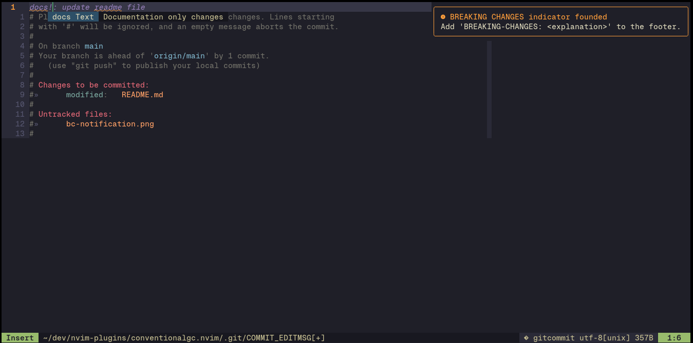

# conventionalgc.nvim
Neovim plugin to make conventional commits directly on gitcommit file.

## Features
### Commit type autocompletion
The commit type autocompletion follows [Conventional Commits](https://kapeli.com/cheat_sheets/Conventional_Commits.docset/Contents/Resources/Documents/index) convention.
> [!NOTE]
> And I added a commit type for commits of merges, it's just 'merge'.

### Optional scopes autocompletion using git-scopes.json file
Just create a json file called 'git-scopes' with a list of your wanted scopes
in your Git repo and the plugin will detect it.
> [!NOTE]
> If you doesn't want use scopes just omit the file,
> in Conventional Commits convention scopes are optional.

### Remember to add Breaking Changes explanation
In CC. convention, you can indicate Breaking Changes with ! after commit type or commit scope.
If you indicate BC. you have to explain them in the commit description, or in the footer
with the word token 'BREAKING-CHANGES' or 'BREAKING CHANGES'.

So for remember you this I use nvim-notify nvim plugin to send you a notification.

## To-do
- [x] Add autocomplete to select commit type.
- [x] Add autocomplete to select optional scope (hints idea drooped).
- [x] Add functionality to send a notification when ! BC indicator is typed (hints idea drooped).
